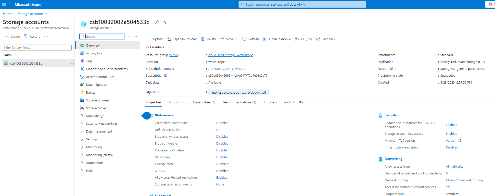

# azure-data-pipelines
Azure Data Pipelines Repo

1. Create the Data Lake and upload data



```sql
CREATE EXTERNAL TABLE [dbo].[NYC_Payroll_Summary](
[FiscalYear] [int] NULL,
[AgencyName] [varchar](50) NULL,
[TotalPaid] [float] NULL
)
WITH (
LOCATION = '/',
DATA_SOURCE = [mydlsfs20230413_mydls20230413_dfs_core_windows_net],
FILE_FORMAT = [SynapseDelimitedTextFormat]
)
GO
```

2. Create an Azure Data Factory Resource

3. Create a SQL Database

4. Create a Synapse Analytics workspace, or use one you already have created.

5. Create summary data external table in Synapse Analytics workspace

6. Create master data tables and payroll transaction tables in SQL DB


Screenshot of the below

DataLakeGen2 that shows files are uploaded

Above 5 tables created in SQL db

External table created in Synapse


Step 2: Create Linked Services

1.Create a Linked Service for Azure Data Lake

In Azure Data Factory, create a linked service to the data lake that contains the data files

From the data stores, select Azure Data Lake Gen 2
Test the connection

2.Create a Linked Service to SQL Database that has the current (2021) data
Test the connection


If you get a connection error, remember to add the IP address to the firewall settings in SQL DB in the Azure Portal
📝Capture screenshot of Linked Services page after successful creation

📝Save configs of Linked Services after creation


Step 3: Create Datasets in Azure Data Factory

1.Create the datasets for the 2021 Payroll file on Azure Data Lake Gen2

Select DelimitedText
Set the path to the nycpayroll_2021.csv in the Data Lake
Preview the data to make sure it is correctly parsed

2. Repeat the same process to create datasets for the rest of the data files in the Data Lake

EmpMaster.csv
TitleMaster.csv
AgencyMaster.csv
Remember to publish all the datasets

3. Create the dataset for all the data tables in SQL DB

4. Create the datasets for destination (target) table in Synapse Analytics
dataset for NYC_Payroll_Summary

📝Capture screenshots of datasets in Data Factory


📝Save configs of datasets from Data Factory


Step 4: Create Data Flows

In Azure Data Factory, create data flow to load 2020 Payroll data from Azure DataLake Gen2 storage to SQL db table created earlier

Create a new data flow
Select the dataset for 2020 payroll file as the source
Click on the + icon at the bottom right of the source, from the options choose sink. A sink will get added in the dataflow
Select the sink dataset as 2020 payroll table created in SQL db
Repeat the same process to add data flow to load data for each file in Azure DataLake to the corresponding SQL DB tables.

📝Capture screenshots of dataflows in Data Factory

📝Save configs of dataflows from Data Factory


Step 5: Data Aggregation and Parameterization

In this step, you'll extract the 2021 year data and historical data, merge, aggregate and store it in DataLake staging area which will be used by Synapse Analytics external table. The aggregation will be on Agency Name, Fiscal Year and TotalPaid.

Create new data flow and name it Dataflow Summary
Add source as payroll 2020 data from SQL DB
Add another source as payroll 2021 data from SQL DB
Create a new Union activity and select both payroll datasets as the source
Make sure to do any source to target mappings if required. This can be done by adding a Select activity before Union
After Union, add a Filter activity, go to Expression builder
Create a parameter named- dataflow_param_fiscalyear and give value 2020 or 2021
Include expression to be used for filtering: toInteger(FiscalYear) >= $dataflow_param_fiscalyear
Now, choose Derived Column after filter
Name the column: TotalPaid
Add following expression: RegularGrossPaid + TotalOTPaid+TotalOtherPay
Add an Aggregate activity to the data flow next to the TotalPaid activity
Under Group by, select AgencyName and FiscalYear
Set the expression to sum(TotalPaid)
Add a Sink activity after the Aggregate
Select the sink as summary table created in SQL db
In Settings, tick Truncate table
Add another Sink activity, this will create two sinks after Aggregate
Select the sink as dirstaging in Azure DataLake Gen2 storage
In Settings, tick Clear the folder


📝Capture screenshot of aggregate dataflow in Data Factory


📝Save config of aggregate dataflow from Data Factory


Step 6: Pipeline Creation
Now, that you have the data flows created it is time to bring the pieces together and orchestrate the flow.

We will create a pipeline to load data from Azure DataLake Gen2 storage in SQL db for individual datasets, perform aggregations and store the summary results back into SQL db destination table and datalake staging storage directory which will be consumed by Synapse Analytics via CETAS.

Create a new pipeline
Include dataflows for Agency, Employee and Title to be parallel
Add dataflows for payroll 2020 and payroll 2021. These should run only after the initial 3 dataflows have completed
After payroll 2020 and payroll 2021 dataflows have completed, dataflow for aggregation should be started.
Refer to the below screenshot. Your final pipeline should look like this

A sample Pipeline flow
A sample Pipeline flow


Step 7: Trigger and Monitor Pipeline

Select Add trigger option from pipeline view in the toolbar
Choose trigger now to initiate pipeline run
You can go to monitor tab and check the Pipeline Runs
Each dataflow will have an entry in Activity runs list


Step 8: Verify Pipeline run artifacts

Query data in SQL DB summary table (destination table). This is one of the sinks defined in the pipeline.
Check the dirstaging directory in Datalake if files got created. This is one of the sinks defined in the pipeline
Query data in Synapse external table that points to the dirstaging directory in Datalake.


📝Capture screenshot of pipeline resource from Datafactory

📝Save config of pipeline from Data Factory

📝Capture screenshot of successful pipeline run. All activity runs and dataflow success indicators should be visible

📝Capture screenshot of query from SQL DB summary table

📝Capture screenshot of dirstaging directory listing in Datalake that shows files saved after pipeline runs

📝Capture screenshot of query from Synapse summary external table